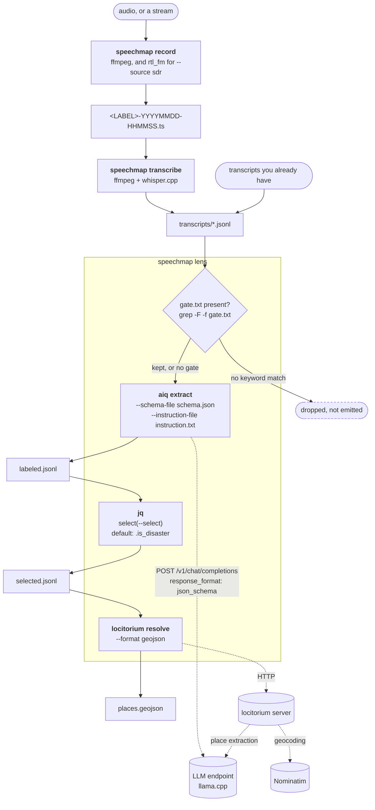
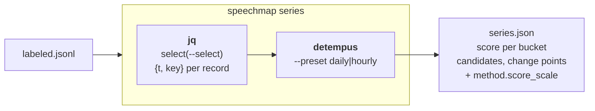

# Architecture

## What this is

Most of the chain is other people's work: ffmpeg, whisper.cpp, llama.cpp,
Nominatim, MapLibre, PMTiles, statsmodels, ruptures. Three pieces are
published separately because they are useful on their own:

| component | what it does |
|---|---|
| [locitorium](https://github.com/yuiseki/locitorium) | text → places grounded to OSM entities |
| [detempus](https://github.com/yuiseki/detempus) | timestamped counts → anomaly candidates and change points |
| [aiq](https://github.com/yuiseki/aiq) (fork) | text → labels, structured fields, embeddings |

OpenSpeechMap is what binds them, which turned out to be the part that was
missing. This is how:



Solid arrows are files on disk; dotted arrows are network calls. Every stage
writes its output, so a later stage can be re-run on its own.

`aiq extract` is called once per record, concurrently, and the lens schema
goes to the endpoint as `response_format` so the output shape is a constraint
on the decoder rather than a request in the prompt. `locitorium resolve` reads
one field, whichever `--place-field` names, and returns OSM entities; it
does its own extraction and geocoding behind its HTTP interface, which is why
it needs both the LLM and Nominatim.

`detempus` is not called by `speechmap`. Counting over time is a separate
question from mapping, it takes a different shape of input, and you will ask it
again with a different bucket without re-running any language model. So it has
its own command:



Why it is arranged this way, and what was rejected along the way, is in
[docs/ADR/](docs/ADR/).

## The stages, and why they are separate

Each stage drives a program that exists on its own, leaves a file behind, and
can be re-run alone.

| stage | command | driven program | what only this can do |
|---|---|---|---|
| capture | `speechmap record` | ffmpeg, rtl_fm | restart a dead capture, delete old segments |
| transcribe | `speechmap transcribe` | ffmpeg, whisper.cpp | decide when a recording started |
| lens | `speechmap` | aiq, locitorium, jq | apply a lens, absorb spelling variants |
| series | `speechmap series` | detempus, jq | count over time, recover the schedule |
| a pass | `speechmap pass` | the three above | run what a declaration names |

They are separate because their failures are separate. Transcription is bound by
the GPU, the lens by a language model that is usually the single scarce
resource, place resolution by another service entirely. One command means one
failure stops everything, and no way to look at what the previous stage
produced. The files between the stages are how anything gets diagnosed.

They are still one thing to start, because `speechmap.yaml` says which of them
to run and `speechmap pass` runs them. Declaring the composition is not the same
as hiding it.

## Idempotence

One output file per input file. The output's existence is the record that the
input is done; there is no state file that can disagree with what is on disk.

```
rec/NPR-...-170218.ts  ->  transcripts/NPR-...-170218.jsonl  ->  out/labeled/NPR-...-170218.jsonl
```

Deleting an output redoes exactly that input. Each output is written to a
temporary name and renamed, so a run killed halfway leaves an output that is
complete or absent, never truncated and looking finished.

The aggregates the viewer reads (`labeled.jsonl`, `selected.jsonl`,
`places.geojson`) are rebuilt from every part on every pass. They are derived,
not state: deleting them costs a concatenation.

## Where the time comes from

Nothing in the chain reads audio metadata. The time enters at capture, in the
segment filename, and is carried from there:

```
NPR-20260823-170218.ts   ->   {"t": "2026-08-23T17:02:18", "seg": "NPR-20260823-170218.ts@0", ...}
```

`speechmap lens` copies each record's time onto every place resolved from it, so a
place knows when it was said and no consumer has to re-join. Getting this wrong
is the most dangerous failure available here, because every later answer stays
plausible.

## Why it is arranged this way

The decisions, and what was rejected reaching them, are in
[ADR/](ADR/). Start with
[0003](ADR/0003-bind-existing-oss.md) on binding rather than rebuilding,
[0002](ADR/0002-lenses-as-data.md) on lenses being data, and
[0015](ADR/0015-idempotent-stages-and-a-declaration.md) on idempotence.
